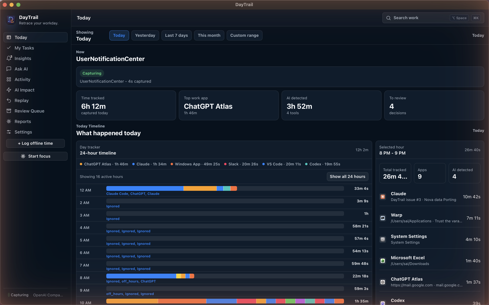
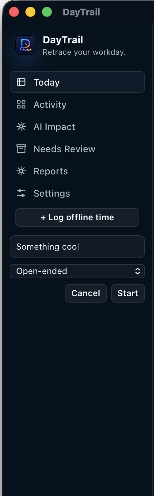
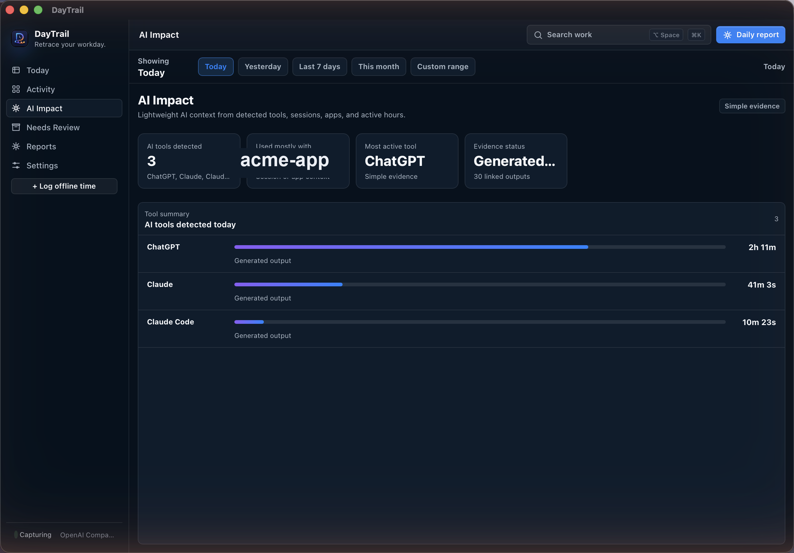
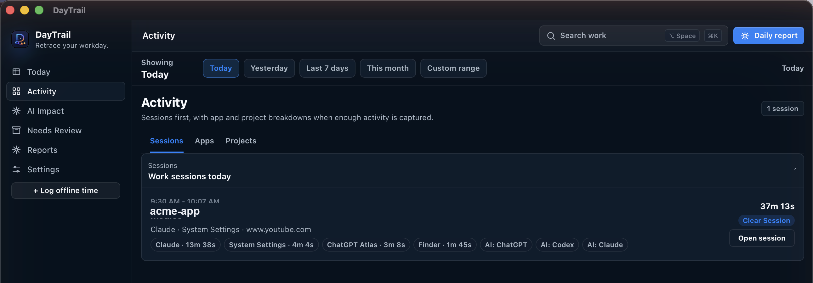
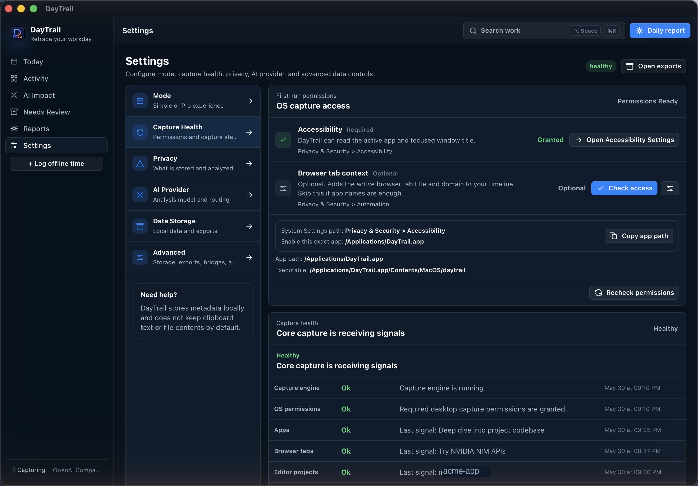

# DayTrail

> *You worked hard today. But do you actually know where the time went?*

Most of us don't. We remember the feeling of a busy day — the tabs, the switching, the "just one more thing" — but when someone asks what we shipped, or why the week felt wasted, the honest answer is a guess.

DayTrail is the app that tells you the truth about your own time. Quietly, privately, entirely on your machine — it builds a real record of your day from the apps you use, the projects you work in, the tabs you visit, the AI tools you lean on. No timers to start. No notes to write. No data leaving your computer.

At the end of the day, you'll know exactly where the hours went. And slowly, that knowledge changes everything.

[](https://github.com/varaprasadreddy9676/DayTrail/actions/workflows/windows-release.yml)
[](https://github.com/varaprasadreddy9676/DayTrail/actions/workflows/macos-release.yml)
[](#license)
[](https://github.com/varaprasadreddy9676/DayTrail/releases/latest)
[](https://ko-fi.com/iamsai)

<p align="center">
  <a href="https://github.com/varaprasadreddy9676/DayTrail/releases">
    
  </a>
  <a href="https://github.com/varaprasadreddy9676/DayTrail/releases/latest">
    
  </a>
</p>

---

## The moment that made this app necessary

It's 6pm. You're tired. You're pretty sure you worked hard — you had your coffee, opened your laptop, kept things moving. But you can't really account for the day. There was a PR review, some Slack, a bug you got pulled into, a YouTube video you "just needed a minute" for. Your standup tomorrow is going to be vague. Your timesheet is going to be a reconstruction. You'll say you spent time on the project when really you spent time *near* it.

This isn't a discipline problem. **Human memory is simply not built for tracking time.** We remember events, not durations. We remember the last thing, not the whole arc. We remember effort as output — and when the output was invisible (reading, researching, getting unstuck), we forget it happened at all.

DayTrail closes that gap. Not by watching you, but by remembering what your computer already knows.

---

## What a day with DayTrail looks like

### Your whole day, reconstructed — automatically



One view. No setup required. You'll see what you're doing right now (not just "Chrome" — the actual tab, the actual project), the real breakdown of where your hours went, and a timeline you can scroll through hour by hour.

The first time you see it, you'll feel something. Maybe recognition. Maybe a little discomfort. Both are useful.

---

## What it helps you see, and why it matters

**Where your day actually went**
Not a rough estimate — the real thing. The 90 minutes in email you'd have called "a quick check." The hour on YouTube you'd have written off as five minutes. When you see it clearly, you can change it.

**Whether you can trust your own memory**
Compare what you remember with the captured timeline. Most people are surprised. Not because they're lazy — because memory is unreliable about time. Once you know this about yourself, you stop blaming yourself for "feeling" productive while getting less done than expected.

**Where focus disappears**
DayTrail shows you the exact moments your attention fragmented — context switches, tab jumps, the gap between intention and action. Patterns repeat. Once you see yours, they're hard to unsee.

**How much of your work runs through AI**
ChatGPT, Claude, Copilot, Cursor — DayTrail tracks all of them as first-class work. You'll know which tools you actually rely on, for how long, and on which projects. As AI becomes woven into how we work, this matters more every week.

**What to say at your standup**
Source-backed. Specific. No reconstructing from memory the night before.

---

## Features that quietly change your relationship with your own work

### Focus Mode — catch the drift before it becomes an hour



Start a focus block — 25, 50, or 90 minutes — and DayTrail sends a gentle native notification when you've drifted to YouTube, Reddit, WhatsApp, or other distractions. It reminds you. It never blocks apps. It never judges. And every session is saved, so you can review later whether the block actually stayed on track.

The difference between a nudge at minute three and discovering the drift at hour two is enormous.

### Proactive AI Insights — the analysis that happens even when you don't ask

With an AI provider configured, DayTrail runs a quiet background analysis every few hours during your work day. Not surveillance — pattern recognition. It surfaces observations you wouldn't have thought to look for:

- You've had three days without a real deep work block
- Your context-switching spiked 60% this week compared to last
- You have two open commitments that haven't been touched in four days
- Your AI tool usage doubled but the project output didn't

High-priority insights fire an OS notification. All of them live in the Insights view — dismissable, filterable, with a one-click "Explore in chat" button that takes you directly into a conversation about what was found.

This is what makes DayTrail feel like an AI-native app rather than a tracker with a dashboard.

### Ask AI — just ask, in plain language

You don't have to navigate a dashboard to get an answer. Open the Ask AI chat and ask what you actually want to know:

> *"How many hours was I in deep work today?"*  
> *"Which tasks are overdue?"*  
> *"What did I work on Tuesday afternoon?"*  
> *"How much time am I spending on meetings vs. building?"*

The AI has access to your captured data — today's sessions, this week's activity, open tasks, commitments, loop risks — and gives you answers grounded in what actually happened, not guesses. Works with Claude, GPT-4, Gemini, or a local Ollama model.

### Smart Breaks — sustainable work without another dashboard

Enabled optionally in Settings. When turned on, DayTrail watches the same foreground-window signals it already uses and notices when you've been at it for a while. It sends blink reminders, posture resets, and short break prompts — at the interval you choose. It stays quiet during calls, presentation-like contexts, or when you step away. No extra card on your Today screen. No medical claims. Just the kind of nudge a good colleague might give you.

### Replay / restore — pick up exactly where you were

After an interruption — a meeting, a lunch, an unexpected call — DayTrail shows you what you were in before you left. The app, the project, the file, the context. You don't have to rebuild the mental model from scratch. The trail is there.

### Weekly digest — a report you're not embarrassed to share

At the end of the week, generate a source-backed digest: what you worked on, how focus held up, where AI tools contributed, what got done. With an AI provider connected, DayTrail turns seven days of local evidence into a first draft for your standup, client update, or OSS changelog. You edit; you don't invent.

### AI Impact — because AI work is real work



DayTrail doesn't lump AI tools into "browsing" or ignore them. It tracks which tools (ChatGPT, Claude, Codex, Copilot, Cursor…), for how long, and on which projects — because that's increasingly where the real work happens.

### Activity — the story behind each session



Every work session breaks down into the apps, projects, and AI tools behind it. A single block of time tells the whole story — not just "I worked on Project X" but how you moved through it.

### Capture Health — it tells you when something breaks



Most trackers fail silently. You lose a full day of data before noticing. DayTrail watches its own capture engine — if a permission gets revoked or a bridge stops working, it tells you exactly what's wrong and how to fix it.

---

## Your data stays yours. Completely.

This is non-negotiable for us. Everything DayTrail captures stays on your machine. Always.

- No cloud sync. No account. No backend you're trusting someone else to secure.
- Screenshots are off by default.
- Clipboard content is never stored.
- Browser URLs are redacted before storage where possible.
- AI providers are optional, configured locally, and queried only when you ask.
- If you uninstall DayTrail, your data stays on your machine — in your control.

See [PRIVACY.md](PRIVACY.md) for the complete model.

---

## Tiny footprint. No Electron bloat.

Built with Tauri + Rust — no bundled Chromium runtime. The macOS Apple Silicon DMG is about **9.8 MB**. Windows installers are under **6 MB**. DayTrail runs light and stays out of your way.

---

## Download

**macOS (Apple Silicon) — Homebrew (recommended):**

```sh
brew tap varaprasadreddy9676/tap
brew install --cask daytrail
```

To update to the latest version:

```sh
brew update && brew upgrade --cask daytrail
```

> **`brew update` first is required.** `brew upgrade` alone uses your local tap cache — without `brew update`, Homebrew won't know a new version exists and will say "already installed". Always run both commands together.

**macOS — one-line installer (no Homebrew needed):**

Paste this in Terminal — it downloads the latest release, installs to `/Applications`, and clears the Gatekeeper flag automatically:

```sh
curl -fsSL https://raw.githubusercontent.com/varaprasadreddy9676/DayTrail/main/scripts/install-macos.sh | bash
```

**macOS — manual DMG:** grab the latest `.dmg` from the [**Releases page**](https://github.com/varaprasadreddy9676/DayTrail/releases/latest), drag to Applications, then run this once to clear the Gatekeeper flag:

```bash
xattr -dr com.apple.quarantine /Applications/DayTrail.app
```

**Windows:** download the `.msi` or `.exe` installer from the same Releases page.

**Other Macs / build from source:** see [Try it](#try-it-build-from-source) below.

---

## Troubleshooting

<details open>
<summary><b>macOS: "DayTrail.app is damaged and can't be opened."</b></summary>

It is **not** damaged. Because the app isn't notarized (no paid Apple Developer ID), macOS blocks the first launch. There are three ways to fix this — pick the easiest:

**Option 1 — use Homebrew** (handles it automatically):
```sh
brew tap varaprasadreddy9676/tap && brew install --cask daytrail
```

**Option 2 — use the one-line installer** (handles it automatically):
```sh
curl -fsSL https://raw.githubusercontent.com/varaprasadreddy9676/DayTrail/main/scripts/install-macos.sh | bash
```

**Option 3 — manual fix after DMG install** (one command, one time per version):
```bash
xattr -dr com.apple.quarantine /Applications/DayTrail.app
```
Drag the app to **Applications** first, then run the command above, then open normally.
</details>

<details>
<summary><b>Windows: "Windows protected your PC" (SmartScreen)</b></summary>

The installer isn't code-signed yet, so SmartScreen warns on first run. Click **More info → Run anyway**.
</details>

<details>
<summary><b>Homebrew: "already installed" or installs an old version</b></summary>

Homebrew caches tap metadata locally. If `brew upgrade --cask daytrail` says the latest is already installed but you know a newer version exists, your local cache is stale.

Fix:

```sh
brew update && brew upgrade --cask daytrail
```

If it still shows the wrong version, force a clean reinstall:

```sh
brew uninstall --cask daytrail && brew install --cask daytrail
```

</details>

<details>
<summary><b>macOS: capture stopped / titles show only the app name</b></summary>

DayTrail needs **Accessibility** permission to read window titles. Open **Settings → Capture Health** in the app — if Accessibility shows as missing, use **Fix accessibility** to re-grant it. A macOS update can silently reset this.
</details>

---

## Set up for a real trial

1. Install the app and grant macOS Accessibility (or Windows equivalent) when prompted.
2. Enable browser extension support if you want tab titles and domains.
3. Install editor and terminal integrations for project and file context.
4. Allow OS notifications for Focus Mode nudges, Smart Breaks, and proactive AI insights.
5. Set your **working hours** in Settings → Capture Health so DayTrail never asks "were you away?" at midnight.
6. Add an AI provider in Settings if you want generated digests, proactive insights, and Ask AI answers. Claude, GPT-4, Gemini, or a local Ollama model all work.
7. Leave DayTrail running from startup. One full workday of capture is when it starts to get interesting.

---

## Platform status

| Platform | Status |
| --- | --- |
| macOS | Primary target. Fully exercised — install, permissions, tray, capture, reporting, Focus Mode, and AI flows. |
| Windows | Backend, tray, terminal bridge, credential storage, and CI installers are implemented. Real smoke testing still required before a signed public release. |
| Linux | Not a release target yet. Some Tauri pieces may work; capture behavior isn't validated. |

---

## Repository layout

```
apps/desktop/              Tauri desktop app — Rust backend, React UI
apps/browser-extension/    Browser extension for tab context
apps/vscode-extension/     VS Code / editor bridge
scripts/                   Build, release, bridge, and verification scripts
docs/                      Supporting docs and screenshot assets
```

---

## Development

Requirements: Node.js 20+, npm, Rust stable, Tauri platform prerequisites for your OS.

```bash
npm ci --prefix apps/desktop
cd apps/desktop && npm run tauri dev
```

Run the full quality gate:

```bash
npm run release:check
```

Targeted checks:

```bash
npm run desktop:check
npm run desktop:test
npm run browser-extension:check
npm run vscode-extension:check
npm run test:scripts
```

---

## Build installers

macOS unsigned local build:

```bash
npm run desktop:dmg
```

Windows installer from a Windows machine:

```powershell
npm run desktop:windows
```

See [RELEASE.md](RELEASE.md) for the full release checklist, signing notes, and verification steps.

---

## Release automation

Every non-release push to `main` triggers a release candidate. If the commit bumps the desktop version, GitHub Actions tags that version. If the current version is already tagged, Actions bumps the patch version, commits, tags, and dispatches macOS and Windows builds automatically.

Use `scripts/release.sh <version>` to cut a specific version manually.

---

## Documentation

- [PRIVACY.md](PRIVACY.md) — local storage, metadata capture, redaction, exports, AI provider behavior
- [SECURITY.md](SECURITY.md) — how to report security issues
- [RELEASE.md](RELEASE.md) — release verification checklist
- [docs/screenshots/README.md](docs/screenshots/README.md) — public screenshot set

---

## Support DayTrail

DayTrail is free and open source, built by one developer in the open. If it's helped you understand your own days — or you just want to see it keep growing — you can support development here:

[](https://ko-fi.com/iamsai)

Stars, issues, and pull requests are equally welcome.

---

## License

MIT OR Apache-2.0. See [LICENSE](LICENSE), [LICENSE-MIT](LICENSE-MIT), and [LICENSE-APACHE](LICENSE-APACHE).
